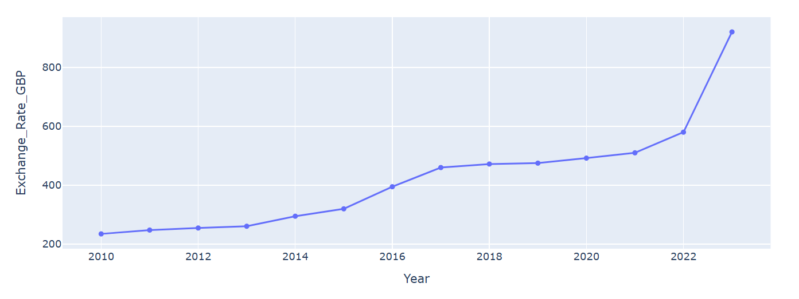
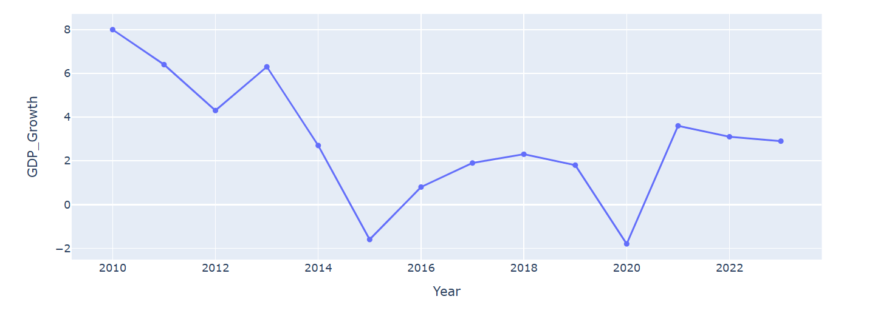

# 🇳🇬 Nigerian Economic Dashboard

This project explores Nigeria's key macroeconomic indicators from 2010 to 2023, using real-world data and Python analysis. It visualizes trends in inflation, exchange rates, GDP growth, unemployment, interest rates, and oil prices — helping uncover insights into how these variables interact and evolve over time.

---

## 📊 Features

- 📈 Inflation trend analysis (2010–2023)
- 💵 USD/NGN and GBP/NGN exchange rate tracking
- 📉 GDP growth rates and recession detection
- 👷‍♂️ Unemployment vs inflation comparison
- 🔗 Correlation heatmap of economic indicators
- 🧪 Clean, commented Jupyter Notebook
## 🖼️ Sample Screenshots

---

## 🧠 Key Insights

- Major depreciation of the Naira post-2015
- 2016 & 2020 recessions clearly visible in GDP data
- Rising unemployment correlates with inflation after 2018
- Oil price drops strongly linked to GDP slowdowns

---

## 🛠️ Tools Used

- Python
- Jupyter Notebook
- pandas, seaborn, matplotlib
- CSV data (manually compiled)

---

## 🗂️ Folder Structure

nigerian-economy-dashboard/
│
├── data/
│ ├── nigeria_macro_data.csv
│ └── cleaned_macro_data.csv
│
├── notebooks/
│ └── analysis.ipynb
│
├── scripts/ ← Coming soon
├── dashboard/ ← Dash App (next)
├── screenshots/ ← Chart images
└── README.md

yaml
Copy
Edit

---

## 🧪 How to Run

1. Open Jupyter Notebook
2. Navigate to `notebooks/analysis.ipynb`
3. Run each cell step-by-step
4. Requires: `pandas`, `matplotlib`, `seaborn`

---

## 💡 Future Plans

- Interactive Dash App version
- Add more historical data (before 2010)
- Automate data updates (CBN/NBS APIs)

---

> Built with ❤️ by [Oklogo Samuel] — feel free to fork, star, or suggest improvements!